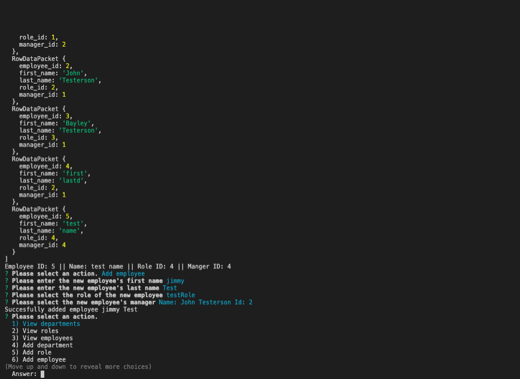

# Employee Management System

# Description
This node based app allows the user to create, update, view, and delete an employee database. There are separate tables for departments, roles, and employees.

# Links
GitHub Repository: https://github.com/ashtonwalden34/employee-management-system